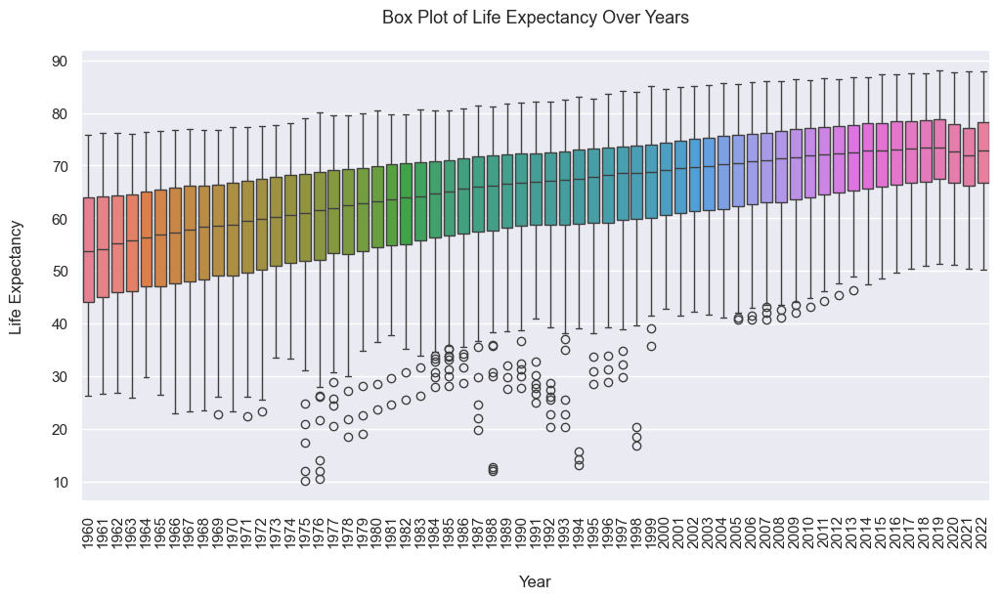

#  Global Life Expectency Trends: Exploratory Data Analysis (EDA) Project

## Description

The objective of this Exploratory Data Analysis (EDA) is to explore and understand the trends and patterns in global life expectancy using data from the [World Bank Group](https://data.worldbank.org/indicator/SP.DYN.LE00.IN?end=2022&start=2022&view=bar). The analysis includes data cleaning, visualization, and statistical analysis using Python libraries such as `Pandas`, `NumPy`, `Matplotlib`, `Seaborn`, and `Plotly`.

The data used for this analysis can be accessed through the links provided below:
- [Download Data](https://api.worldbank.org/v2/en/indicator/SP.DYN.LE00.IN?downloadformat=excel)
- [Online Data](https://data.worldbank.org/indicator/SP.DYN.LE00.IN)

## Features
- Data cleaning and preprocessing
- Statistical, univariate, and bivariate analysis
- Visualization of data distributions and relationships
- Interactive plots using Plotly

## Project Structure
- **data/:** Contains the dataset used for analysis.
- **data/Exported:** Contains the final datasets created during analysis.
- **notebooks/:** Jupyter notebooks with the EDA process.
- **images/:** Saved plots and visualizations.
- **README.md:** Project documentation.

## Installation
### Prerequisites
- `Python` Version: 3.13.2 | packaged by Anaconda
- `jupyter` notebook version 7.3.3
- Install the required libraries using: `pip install -r requirements.txt`.

### Running the Notebook

1. Open the `.ipynb` file in Jupyter by running: `jupyter notebook`.
2. Run all cells in the notebook.

## Usage
After running the notebook, you will gain insights into global life expectancy trends, including:
- Historical changes in life expectancy across different regions.
- Factors influencing life expectancy.
- Visual comparisons between countries.

## Sample Visualization

## License
This project is licensed under the MIT License - see the LICENSE file for details.

## Contact
For questions or suggestions, please contact me via the email on my profile or [LinkedIn](https://www.linkedin.com/in/christine-coomans/).
