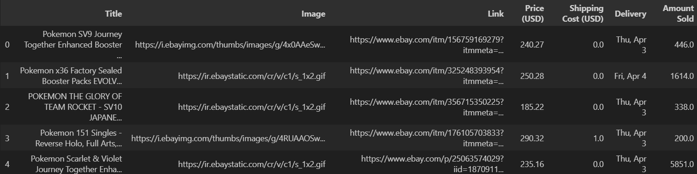

# eBay Pokémon Collectibles Scraper

This project provides a Python-based scraper designed to extract and analyze Pokémon collectible listings from the [eBay website](https://www.ebay.com/b/Sealed-Collectible-Card-Game-Packs/183456/bn_1893736). By automating data collection, this scraper facilitates efficient analysis and visualization of collectible details, including titles, images, prices, shipping costs, and sales data. By using libraries like `selenium`, `beautifulsoup4`, and `pandas`, the scraper retrieves, processes, and transforms the data into a structured format for further insights.

**The final exported data can be viewed through two methods:**
- Using the Excel file `data/pokemon_cards_data.xlsx`
- Utilizing the CSV file `data/pokemon_cards_data.csv`

**Here is a sample of the data scraped:**

## Navigation
1. [Objective](#objective)
2. [Data Source](#data-source)
3. [Features](#features)
4. [Usage](#usage)
5. [Further Exploration](#further-exploration)

## Objective
The primary objective of this scraper is to automate the collection of Pokémon collectible listings from eBay, enabling analysts to efficiently perform in-depth analysis and visualization using tools like pandas and matplotlib.

## Data Source
- **URL:** [eBay Pokémon Collectibles](https://www.ebay.com/b/Pokemon-TCG/2536/bn_7117595258)
- **Endpoints:** It scrapes the first few pages of the eBay Pokémon collectibles section.
- **Data Points:** The scraper provides the following data points:
    - Title
    - Image
    - Link
    - Price (USD)
    - Shipping Cost (USD)
    - Delivery Date
    - Amount Sold

## Features
### Data Extraction:
- The scraper uses Selenium to navigate through multiple pages of listings and BeautifulSoup to parse the HTML content.
- It processes the data to extract relevant information such as titles, images, prices, and sales data.

### Data Preprocessing:
- The extracted data is organized into a pandas DataFrame, making it easy to manipulate and analyze.
- The data is formatted, cleaned, and enriched with additional metrics like realtime currency conversion and sales analysis.

### Data Export:
- The processed data is exported to both Excel and CSV formats.
- This allows users to perform further analysis using spreadsheet software or import the data into other analytical tools.

### Error Handling:
- The scraper includes error handling to manage potential issues such as network errors or changes in the website structure.

## Usage
### Prerequisites
- Python 3.8+.
- Install the required libraries: `pip install -r requirements.txt`.
- Ensure you have the appropriate WebDriver (e.g., ChromeDriver) installed and in your `PATH`.

### Running the Scraper

**Using the Jupyter Notebook:**
1. Open `scraper.ipynb` in Jupyter Notebook.
2. Run all cells in the notebook.

**Using the Python Script:**
- Open a terminal or command prompt.
- Navigate to the project directory.
- Run the script: `python scraper.py`

## Further Exploration
With the data, users can perform a variety of analytics to gain insights into Pokémon collectibles. Here are potential use-cases for the dataset:
- **Price Analysis:** Analyze the distribution of prices and identify trends in collectible values.
- **Sales Performance:** Examine sales data to determine which collectibles are most popular.
- **Shipping and Delivery:** Explore shipping costs and delivery times to assess logistical efficiency.