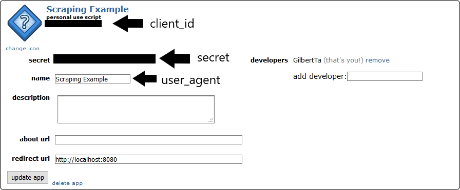

# Reddit `r/confession` Data Scraper

This project provides a Python-based scraper designed to extract and analyze data from the "Confessions" subreddit on Reddit. By automating data collection, this scraper facilitates efficient analysis and visualization of post interactions, sentiment, and user activity. Leveraging libraries like `praw`, `pandas`, and `matplotlib`, the scraper retrieves, processes, and transforms the data into a structured format for further insights.

**The final exported data can be viewed through two methods:**
- Using the Excel file `data/reddit_confessions_data.xlsx`
- Utilizing the CSV file `data/reddit_confessions_data.csv`

**Here is a sample of the data scraped:**
| URL                                           | Author          | Title                        | Story                                  | Upvotes | Comment Count | Word Count | Unique Word Count | Character Count | Sentiment | Author Submissions | Author Comments |
|-----------------------------------------------|-----------------|------------------------------|----------------------------------------|---------|---------------|------------|-------------------|-----------------|-----------|--------------------|-----------------|
| [Link](https://www.reddit.com/r/AmItheAsshole/comment/...) | OnlyInQuebec    | AITA for telling my wife...  | My brother in-law (Sammy) lost his home... | 810     | 175           | 486        | 272               | 2664            | 0.067692  | 12                 | 3               |
| [Link](https://www.reddit.com/r/AmItheAsshole/comment/...) | Renegadesrule33 | UPDATE, AITA for despising...| I'm back like I said I would be...     | 727     | 791           | 104        | 144               | 954             | 0.092093  | 28                 | 10              |

## Navigation
1. [Objective](#objective)
2. [Data Source](#data-source)
3. [Features](#features)
4. [Usage](#usage)
5. [Further Exploration](#further-exploration)

## Objective
The primary objective of this scraper is to automate the collection of Reddit posts from the `confession` subreddit, enabling analysts to efficiently perform in-depth analysis and visualization using tools like Excel and pandas.

## Data Source
- **API:** [Reddit API](https://www.reddit.com/dev/api)
- **Endpoints:** `r/confession` subreddit fetched using [Praw](https://praw.readthedocs.io/en/stable/)
- **Data Points:** The API provides the following data points:
    - URL
    - Author
    - Title
    - Story
    - Upvotes
    - Comment Count
    - Tags
    - Word Count
    - Unique Word Count
    - Character Count
    - Sentiment
    - Author Submissions
    - Author Comments

## Features
### Data Extraction:
- The scraper uses the praw library to connect to Reddit's API and retrieve posts from the AITA subreddit.
- It processes the data to extract relevant information such as post content, interactions, and user activity.

### Data Preprocessing:
- The extracted data is organized into a pandas DataFrame, making it easy to manipulate and analyze.
- The data is formatted, cleaned, and enriched with additional metrics like word count, sentiment analysis, and user activity.

### Data Export:
- The processed data is exported to both Excel and CSV formats.
- This allows users to perform further analysis using spreadsheet software or import the data into other analytical tools.

### Error Handling:
- The scraper includes error handling to manage potential issues such as network errors, rate limits, or invalid API responses.

## Usage
### Prerequisites
- Python 3.8+.
- Install the required libraries: `pip install -r requirements.txt`.
- Create a Reddit account and register an application to obtain API credentials.
- Add `CLIENT_ID`, `CLIENT_SECRET`, and `USER_AGENT` to a .env file.

### Running the Scraper

**Using the Jupyter Notebook:**
1. Open `scraper.ipynb` in Jupyter Notebook.
2. Run all cells in the notebook.

**Using the Python Script:**
- Open a terminal or command prompt.
- Navigate to the project directory.
- Run the script: `python scraper.py`

## Further Exploration

With the data, users can perform a variety of analytics to gain insights into the Confession subreddit. Here's potential use-cases for the dataset:
- **Sentiment Analysis:** Analyze the sentiment of posts to understand the overall mood and tone of the subreddit.
- **Interaction Trends:** Examine trends in upvotes and comments to determine which types of posts generate the most engagement.
- **Content Analysis:** Explore the content of posts by analyzing word count, unique word count, and character count.
- **Future Predictions:** Use historical data to predict future trends in post interactions and sentiment.