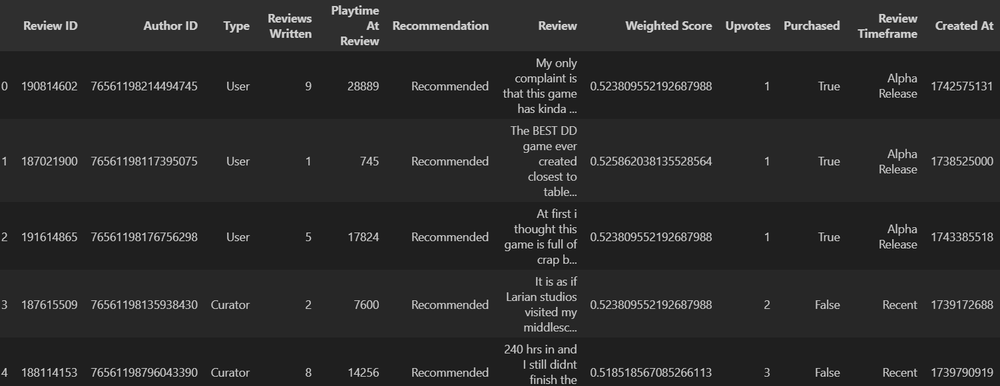

# Balders Gate 3 Steam Reviews Scraper

This project provides a Python-based scraper designed to extract and analyze reviews from the [Steam](https://store.steampowered.com/app/1086940/Baldurs_Gate_3/) platform. By automating data collection, this scraper facilitates efficient analysis and visualization of review details, including review text, author information, playtime, and recommendation status. By using libraries like `requests`, `pandas`, and `matplotlib`, the scraper retrieves, processes, and transforms the data into a structured format for further insights.

**The final exported data can be viewed through two methods:**
- Using the Excel file `data/baldurs_gate_3_data.xlsx`
- Utilizing the CSV file `data/baldurs_gate_3_data.csv`

**Here is a sample of the data scraped:**

## Navigation
1. [Objective](#objective)
2. [Data Source](#data-source)
3. [Features](#features)
4. [Usage](#usage)
5. [Further Exploration](#further-exploration)

## Objective
The primary objective of this scraper is to automate the collection of reviews from the Steam platform, enabling analysts to efficiently perform in-depth analysis and visualization using tools like pandas and matplotlib.

## Data Source
- **URL:** [Baldurs Gate 3 Steam Store Page](https://store.steampowered.com/app/1086940/Baldurs_Gate_3/)
- **Endpoints:** It scrapes reviews for a specified game using its `app ID`.
- **Data Points:** The scraper provides the following data points:
    - Review ID
    - Author ID
    - Type (User/Curator)
    - Playtime At Review
    - Recommendation
    - Weighted Score
    - Review Text
    - Review Timeframe (Early Access/ Beta/ Alpha)

## Features
### Data Extraction:
- The scraper uses the requests library to fetch review data from the Steam API.
- It processes the data to extract relevant information such as review text, author information, and recommendation status.

### Data Preprocessing:
- The extracted data is organized into a pandas DataFrame, making it easy to manipulate and analyze.
- The data is formatted, cleaned, and enriched with additional metrics like word count, sentiment analysis, and user activity.

### Data Export:
- The processed data is exported to both Excel and CSV formats.
- This allows users to perform further analysis using spreadsheet software or import the data into other analytical tools.

### Error Handling:
- The scraper includes error handling to manage potential issues such as network errors or changes in the website structure.

## Usage
### Prerequisites
- Python 3.8+.
- Install the required libraries: `pip install -r requirements.txt`.

### Running the Scraper

**Using the Jupyter Notebook:**
1. Open `scraper.ipynb` in Jupyter Notebook.
2. Run all cells in the notebook.

**Using the Python Script:**
- Open a terminal or command prompt.
- Navigate to the project directory.
- Run the script: `python scraper.py`

## Further Exploration
With the data, users can perform a variety of analytics to gain insights into reviews. Here are potential use-cases for the dataset:
- **Sentiment Analysis:** Analyze the sentiment of reviews to understand player satisfaction.
- **Trend Analysis:** Examine trends in reviews over time to determine how updates affect player opinions.
- **Playtime Insights:** Explore the relationship between playtime and recommendation status.